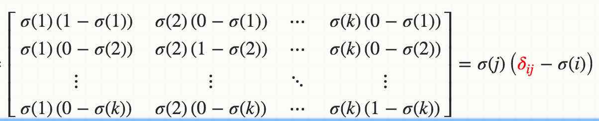

## Neural Network

### Activation

#### Sigmoid

- Defining:

- Derivative:

- Cons:
  - Not a zero centric function.
  - Suffers with gradient vanishing.
  - Output of values which are far away from centroid is close to zero.
  - Computationally expensive because it has to calculate exponential value in function.
- Cons:
  - Smooth gradient, preventing “jumps” in output values.
  - Output values bound between 0 and 1, normalizing the output of each neuron.

#### Tanh

- Defining:
  <!-- $$
  \sigma(x) = \dfrac{e^{x} - e^{-x}}{e^{x} + e^{-x}}
  $$ -->

- Derivative:

  <!-- $$
  \dfrac{\partial}{\partial x}\sigma(x) = (1 - \sigma^2(x))
  $$ -->

- Cons:
  - more computation expensive than sigmoid function.
  - suffers with gradient vanishing.
  - output of values which are far away from centroid is close to zero.
- Pros:
  - have all advantages of sigmoid function and it also a zero centric function.

#### ReLU

- Defining:
  <!-- $$
  \sigma(x) = \mathrm{max}(0, x)
  $$ -->

- Derivative:

  <!-- $$
  \dfrac{\partial}{\partial x}\sigma(x)=
    \begin{cases}
    0 & \text{if } x < 0 \\
    1 & \text{if } x > 0 \\
    \end{cases}
  $$ -->

- Cons:
  - No matter what for negative values neuron is completely inactive.
  - Non zero centric function.
- Pros:
  - No gradient vanishing
  - Derivative is constant
  - Less computation expensive

#### PReLU

- Defining:
  <!-- $$
  \sigma(x) =
    \begin{Bmatrix} x & x >= 0 \\
    \alpha x & x < 0 \\
    \end{Bmatrix}
  $$ -->

- Derivative:

  <!-- $$
  \dfrac{\partial}{\partial x}\sigma(x)=
    \begin{cases}
    \alpha & \text{if } x < 0 \\
    1 & \text{if } x > 0 \\
    \end{cases}
  $$ -->

- Cons:
  - it can’t be used for the complex Classification. It lags behind the Sigmoid and Tanh for some of the use cases.
- Pros:
  - are one attempt to fix the “dying ReLU” problem by having a small negative slope (of 0.01, or so).

#### ELU

- Defining:
  <!-- $$
  \sigma(z) =
    \begin{Bmatrix} z & z >= 0 \\
    α.( e^z – 1) & z < 0\\
    \end{Bmatrix}
  $$ -->

- Derivative:

  <!-- $$
  \dfrac{\partial}{\partial x}\sigma(x) =
    \begin{Bmatrix} 1 & z>=0 \\
    \alpha.e^z & z<0 \\
    \end{Bmatrix}
  $$ -->

- Cons: For x > 0, it can blow up the activation with the output range of [0, inf].
- Pros:
  - help alleviate the vanishing gradient
  - it has a nonzero gradient when x < 0, avoids the dying units issues.
  - is smooth every where, helps speed up GD

#### Speed: elu > prelu > relu > tanh > logistic

#### Softmax

- Defining:

  <!-- $$
  \sigma(j)=\frac{\exp(\mathbf{w}_j^\top \mathbf x)}{\sum_{k=1}^K \exp(\mathbf{w}_k^\top\mathbf x)}=\frac{\exp(z_j)}{\sum_{k=1}^K \exp(z_k)}
  $$ -->

- Derivative:
  <!-- $$
  \frac{\partial}{\partial \mathbf{w}_i}\sigma(j)=\sigma(j)\left(\delta_{ij}-\sigma(i)\right)\mathbf x
  $$ -->

### Run

- `python neu.py`
