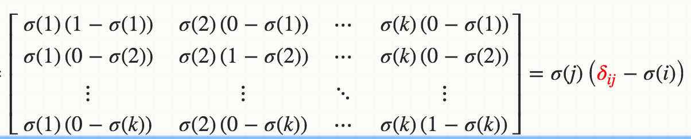

## Neural Network

### Activation

#### Sigmoid

- Defining:

- Derivative:

- Cons:
  - Not a zero centric function.
  - Suffers with gradient vanishing.
  - Output of values which are far away from centroid is close to zero.
  - Computationally expensive because it has to calculate exponential value in function.
- Cons:
  - Smooth gradient, preventing “jumps” in output values.
  - Output values bound between 0 and 1, normalizing the output of each neuron.

#### Tanh

- Defining:

- Derivative:

- Cons:
  - more computation expensive than sigmoid function.
  - suffers with gradient vanishing.
  - output of values which are far away from centroid is close to zero.
- Pros:
  - have all advantages of sigmoid function and it also a zero centric function.

#### ReLU

- Defining:

- Derivative:

- Cons:
  - No matter what for negative values neuron is completely inactive.
  - Non zero centric function.
- Pros:
  - No gradient vanishing
  - Derivative is constant
  - Less computation expensive

#### PReLU

- Defining:

- Derivative:

- Cons:
  - it can’t be used for the complex Classification. It lags behind the Sigmoid and Tanh for some of the use cases.
- Pros:
  - are one attempt to fix the “dying ReLU” problem by having a small negative slope (of 0.01, or so).

#### ELU

- Defining:

- Derivative:

- Cons: For x > 0, it can blow up the activation with the output range of [0, inf].
- Pros:
  - help alleviate the vanishing gradient
  - it has a nonzero gradient when x < 0, avoids the dying units issues.
  - is smooth every where, helps speed up GD

#### Speed: elu > prelu > relu > tanh > logistic

#### Softmax

- Defining:

- Derivative:

### Run

- `python mlp.py`
